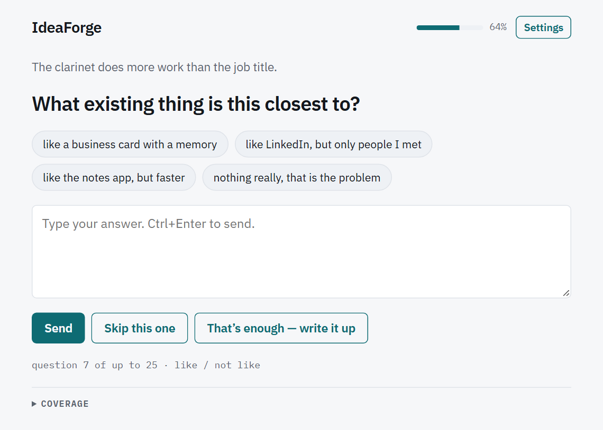
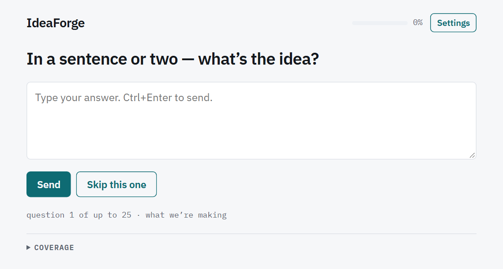
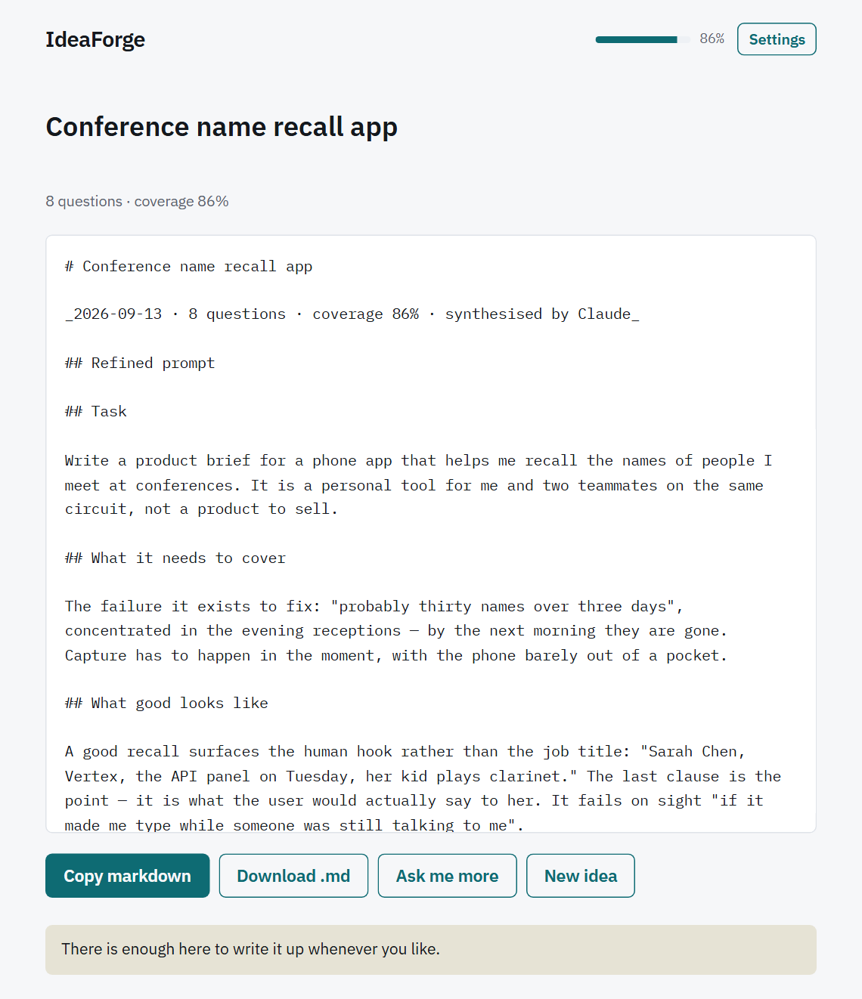
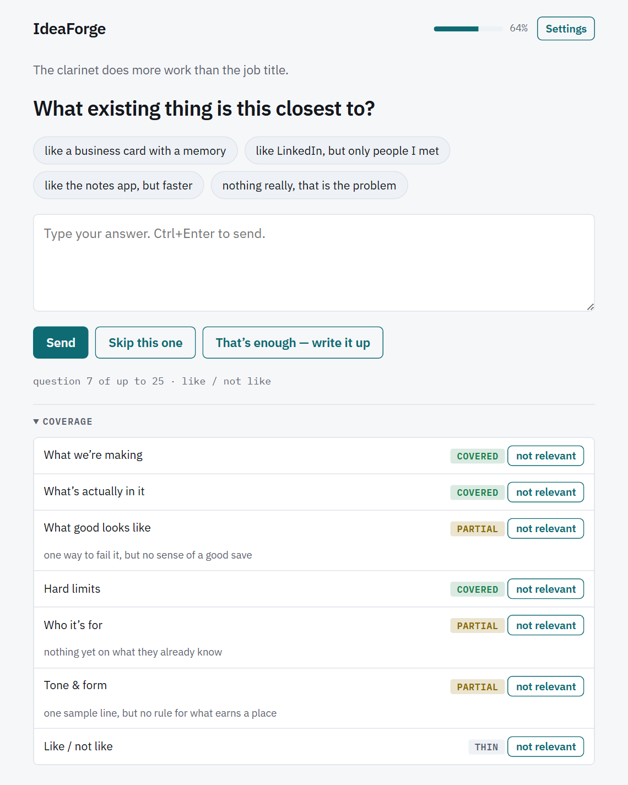
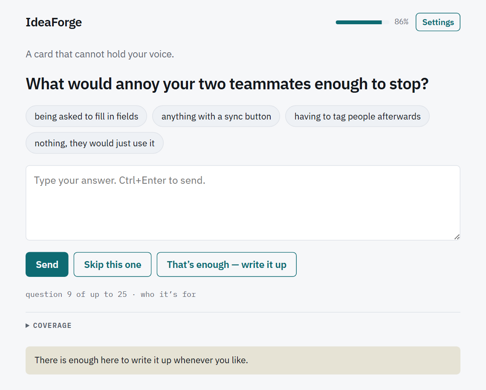
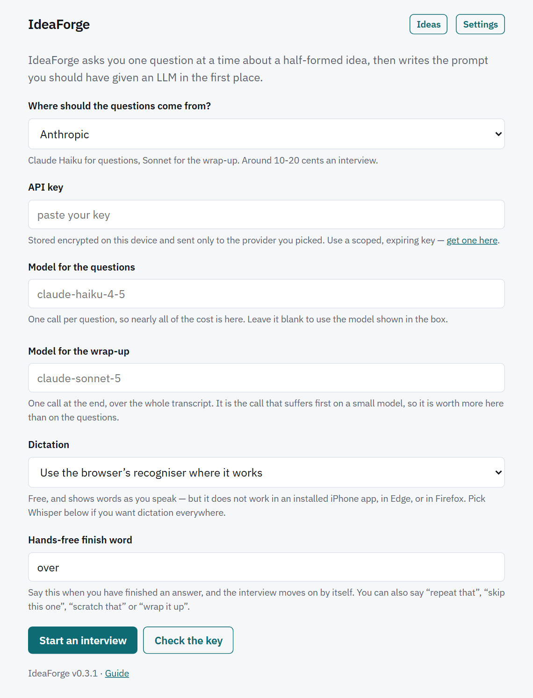

<p align="center">
  
</p>

# IdeaForge

[](https://github.com/jaypetez/ideaforge/actions/workflows/ci.yml)
[](LICENSE)
[](package.json)

An interviewer that forges a half-formed idea into a usable LLM prompt.

**→ [Try it](https://jaypetez.github.io/ideaforge/)** — it runs entirely in your browser
with your own API key. Nothing is sent anywhere but the provider you pick.

You have a vague idea. You know things about it you would never think to type — the real
numbers, the case you have in mind, the thing that would make you throw the output away.
IdeaForge asks you one question at a time until it has those, then writes the prompt you
should have given an LLM in the first place.

It stops on its own. Seven dimensions are tracked, and a dimension only counts as covered
when the model can quote you verbatim on it — so the interview ends when there is genuinely
enough to write from, not when the model feels finished.

## What it looks like

<p align="center">
  <picture>
    <source media="(prefers-color-scheme: dark)"
            srcset="docs/screenshots/03-mid-interview.dark.png">
    
  </picture>
</p>

One question, a short bridge that proves it read your last answer, and three or four chips
you can tap if you would rather edit a sentence than write one. The line underneath tells you
which of the seven dimensions this question is serving, and the meter tells you how much is
left.

Every screenshot on this page, and the whole worked example below, is generated by
`npm run screenshots` — it drives the real app in headless Chrome against a scripted model
and photographs what happens. They are not mockups, and they cannot quietly drift away from
the app.

## From a half-formed idea to a forged prompt

Here is a complete interview. The idea it starts from is about as thin as they come.

<p align="center">
  <picture>
    <source media="(prefers-color-scheme: dark)"
            srcset="docs/screenshots/02-first-question.dark.png">
    
  </picture>
</p>

The first question is always the same one, and it never costs a model call. Everything after
it is built from what you just said:

```text
Q1  In a sentence or two — what’s the idea?
A1  An app that helps me remember the names of people I meet at conferences.

Q2  At the last conference, how many names did you actually lose?            concretize
A2  Probably thirty names over three days. The ones I lose are from the evening
    receptions, and by the next morning they are completely gone.

Q3  What would make you delete this in the first week?                       anti_goal
A3  I would delete it in the first week if it made me type while someone was
    still talking to me.

Q4  What are the hard limits on time and signal here?                        boundary
A4  Three seconds, one thumb, and it has to work with no signal. Those are hard
    limits — the conference wifi is gone by the afternoon.

…

Q6  Write the line you would want on screen when she walks up.               sample_output
A6  On screen I want one line: Sarah Chen, Vertex, the API panel on Tuesday, her
    kid plays clarinet. That last bit is what I would actually say to her.
```

Note what the questions are *not*. None of them asks about your target audience, your
go-to-market, or how you will measure success at scale — those are questions whose answers
the asker could have guessed, and the interviewer is forbidden from producing them. Each one
asks for an instance, a preference under pressure, or a boundary: the last conference, the
first week, the line on the screen.

Eight questions in, every dimension has your own specifics behind it and the interview offers
to stop. What it hands back:

```markdown
# Conference name recall app

_2026-09-13 · 8 questions · coverage 86% · synthesised by Claude_

## Refined prompt

## Task

Write a product brief for a phone app that helps me recall the names of people I meet
at conferences. It is a personal tool for me and two teammates on the same circuit, not
a product to sell.

## What good looks like

A good recall surfaces the human hook rather than the job title: "Sarah Chen, Vertex,
the API panel on Tuesday, her kid plays clarinet." The last clause is the point — it is
what the user would actually say to her. It fails on sight "if it made me type while
someone was still talking to me".

## Constraints

"Three seconds, one thumb, and it has to work with no signal." The conference wifi is
gone by the afternoon, so working offline is a requirement rather than a nice-to-have.
```

That is a prompt you could not have written in one sitting, because most of it is things you
knew but had no reason to type.
**[Read the whole exported file →](docs/examples/remember-names.md)** — it also carries the
assumptions the model had to make, the questions you did not answer, a coverage table, and
the full verbatim transcript.

<p align="center">
  <picture>
    <source media="(prefers-color-scheme: dark)"
            srcset="docs/screenshots/06-refined-prompt.dark.png">
    
  </picture>
</p>

## Why it stops on its own

The interview is not counting turns. It is tracking seven dimensions, and each one is graded
against a writing test rather than a satisfaction test: *could I write this section right now,
from their own specifics, such that a stranger would make the same choices they would?*

<p align="center">
  <picture>
    <source media="(prefers-color-scheme: dark)"
            srcset="docs/screenshots/04-coverage.dark.png">
    
  </picture>
</p>

The model grades itself, and self-reported progress drifts optimistic, so the grades go
through a ratchet before they count. Coverage never falls. It rises at most one level per
dimension per turn, and at most two dimensions per turn. And `covered` is refused outright
unless the model can produce a **verbatim quote from you** to justify it — its own inference
is not evidence.

That last rule is the one doing the work. It is why the interview cannot congratulate itself
to a finish, and why a dimension you were vague about stays visibly open instead of being
written up from an invention.

When there is enough, it says so and leaves the decision to you:

<p align="center">
  <picture>
    <source media="(prefers-color-scheme: dark)"
            srcset="docs/screenshots/05-ready-to-wrap.dark.png">
    
  </picture>
</p>

Four other things can end it: you can wrap up whenever you like, you can mark a dimension
*not relevant* and it stops being asked about, a soft ceiling at 18 questions suggests
stopping, and a hard ceiling at 25 enforces it. There is also an exhaustion exit — if two
turns in a row produce no real gain *after* the ratchet has had its say, it offers to stop
rather than circling.

## Running it

No build step, no dependencies. Node 22 or newer, and any static server over a real origin:

```sh
npm run serve      # then open http://127.0.0.1:8765
```

`file://` will not work — ES modules, IndexedDB and the service worker all need an origin.
(`npm run serve` shells out to `python`; anything that serves a directory will do just as
well.)

Install it to your home screen or desktop from the browser menu and it runs offline, from
the built-in question bank, until a model is reachable again.

## Bringing your own key

<p align="center">
  <picture>
    <source media="(prefers-color-scheme: dark)"
            srcset="docs/screenshots/01-setup.dark.png">
    
  </picture>
</p>

Pick a provider and paste a key. The options:

| Provider | Cost | Notes |
|---|---|---|
| **Groq** | free tier, no card | The easiest start. |
| **Anthropic** | ~10–20¢ per interview | Haiku asks the questions, Sonnet writes the wrap-up. |
| **OpenAI** | a few cents | `gpt-5-nano` for turns. |
| **OpenRouter** | varies | Anything it fronts. |
| **Ollama / LM Studio** | free | Local. Pick the model from what you have pulled — see below. |
| **Another local server** | free | Any OpenAI-compatible server on `localhost`. |
| **Claude viewer** | no key at all | Only inside a Claude artifact viewer. |

**About the key.** It is encrypted with a non-extractable `CryptoKey` and stored in
IndexedDB on your device, and it is sent to exactly one host — the provider you picked,
which is also the only host the page's CSP permits it to talk to. What that does *not*
defend against is a malicious script running on this origin, which could use the key
exactly as the app does. The mitigations are that this app has zero dependencies and no
third-party scripts, and that you should mint a **scoped, expiring** key rather than
handing it your main one.

Do not paste an API key into a **shared** Claude artifact — anyone the artifact is shared
with can read the page. Inside a Claude viewer, use the built-in `sample` provider.

**The one-command version.** If you have Docker and an NVIDIA GPU, this brings up a model
and the app together, with nothing to configure and no key anywhere:

```sh
docker compose -f docker/compose.yml up -d
docker compose -f docker/compose.yml exec ollama ollama pull qwen2.5:7b-instruct
# then open http://localhost:8765 and pick "Ollama (local)"
```

Both ends publish on `127.0.0.1`, which is what keeps them loopback as far as the browser
is concerned — see below for why that matters. If you already run Ollama natively, port
11434 is taken; `IDEAFORGE_OLLAMA_PORT=11435` moves the container's, and you type that
address into the app's **Server address** field.

**A local model is easiest from a local page.** `npm run serve`, pick Ollama, press
**Check the connection** and the model box fills with whatever you have actually pulled.
Ollama allows any localhost origin out of the box, so there is nothing to configure.

From the hosted site it takes two steps, and one of them is easy to miss. Ollama answers an
origin it does not recognise with no CORS headers at all, so it needs
`OLLAMA_ORIGINS=https://jaypetez.github.io` in its environment **and a restart** — it reads
that variable at startup, so exporting it in another shell changes nothing. LM Studio has
the same setting in its server panel. Chrome will also ask permission the first time a page
on the internet reaches your local network, which is a prompt to accept rather than
something to configure. Safari refuses an `http://` request from an `https://` page
outright and has no setting that changes it. So: if you want to run against a local model,
running the app locally too is still the path of least resistance.

## Talking instead of typing

Tap **Answer out loud** to dictate one answer, or turn on **hands-free** and the app reads
each question aloud, listens, and moves on when you stop talking. Dictated answers are
marked as such: the interviewer is told to read them for intent and never to ask you to
clarify a mis-transcription, and the export records which answers you spoke.

There are two dictation backends — the browser's own recogniser, which is free and shows
words as you speak, and Whisper via Groq or OpenAI, which costs about a penny an interview
and is noticeably better on rambling or jargon-heavy speech. The app picks between them by
*testing*, not by asking the browser what it supports, because
`webkitSpeechRecognition` **exists and does nothing** inside an installed iOS home-screen
app: it constructs, `start()` returns cleanly, and no event ever fires.

**If you want to dictate on an installed iPhone app, set a transcription key** — the browser
path cannot work there. Without one, the app says so rather than showing a mic button that
hangs. The full reasoning, and what Edge and Firefox each do instead, is in
[CLAUDE.md](CLAUDE.md#voice-probe-by-behaviour-never-by-feature-detection).

## How it is built

```
src/core/       pure interview logic — no DOM, no network, no clock
src/runtime/    the turn loop; provider and clock injected, so it is testable offline
src/providers/  the only directory allowed to touch the network
src/store/      IndexedDB sessions and the encrypted key
src/voice/      dictation, transcription and reading questions aloud
src/ui/         the app shell
```

`tools/lint-purity.mjs` fails the build if anything under `src/core/` or `src/runtime/` so
much as mentions `window`, `fetch` or `document`. That boundary is what keeps the interview
engine portable and the turn loop testable without a network — the whole suite runs in under
a second, with no mocking framework and no network access.

```sh
npm test             # the purity lint, then 161 tests
npm run test:browser # 69 checks in real Chrome, for what Node cannot see
npm run validate:local # a whole interview against a real local model, no key, no human
npm run screenshots  # regenerate every image and the worked example above
```

The browser checks exist because IndexedDB, non-extractable WebCrypto keys, MediaRecorder,
the Web Speech API, service workers and the CSP have no Node equivalent, and code that
touches them can be perfectly green in `npm test` and broken in a browser.

## What it does when things break

An interview never dead-ends. If the model is unreachable, returns nonsense twice, or you
have no key at all, the next question comes from a built-in bank of 21 and the export says
so. The transcript and your open questions survive a failed wrap-up — only the refined
prompt is lost, and you can retry it.

## Contributing

[CONTRIBUTING.md](CONTRIBUTING.md) covers the setup, what a good change looks like, and
how to add a provider; [docs/ARCHITECTURE.md](docs/ARCHITECTURE.md) is the map — what owns
the session, what happens when a turn fails, and which costs this codebase has knowingly
taken on. [CLAUDE.md](CLAUDE.md) and [AGENTS.md](AGENTS.md) record the invariants that fail
silently when broken, which is most of them. Security policy and the honest threat model are in
[SECURITY.md](SECURITY.md).

## Licence

MIT.
