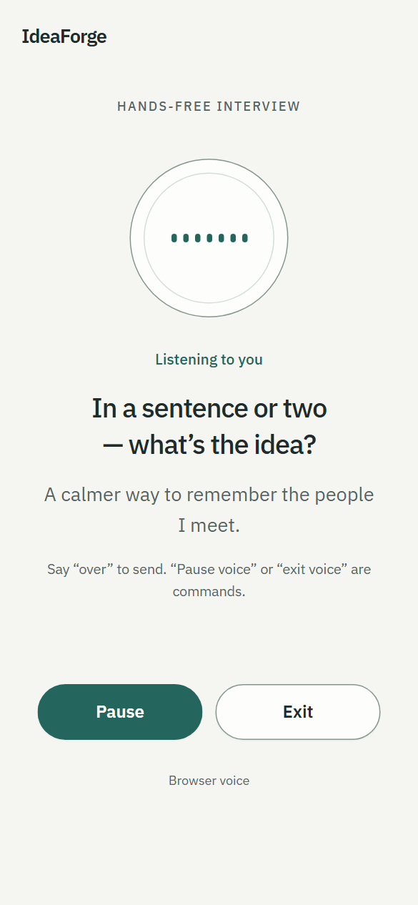
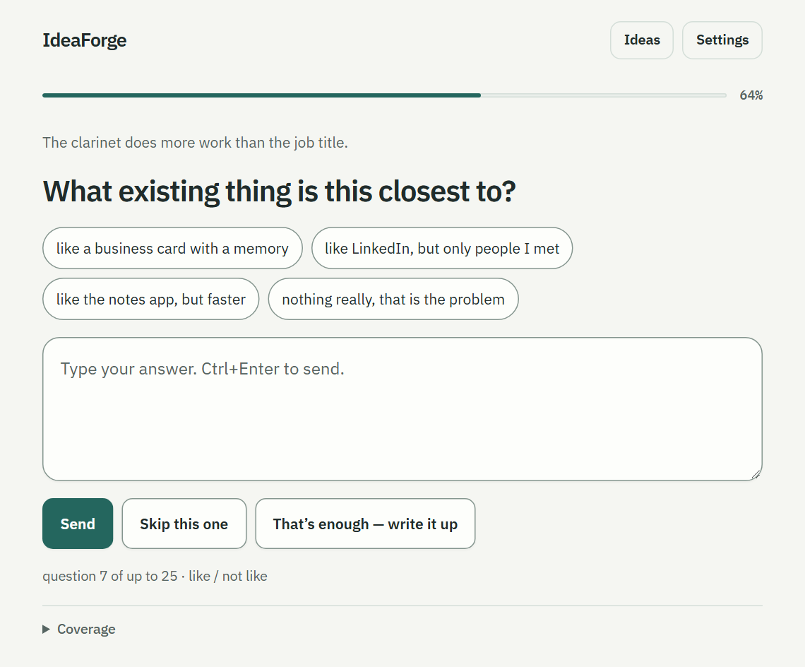
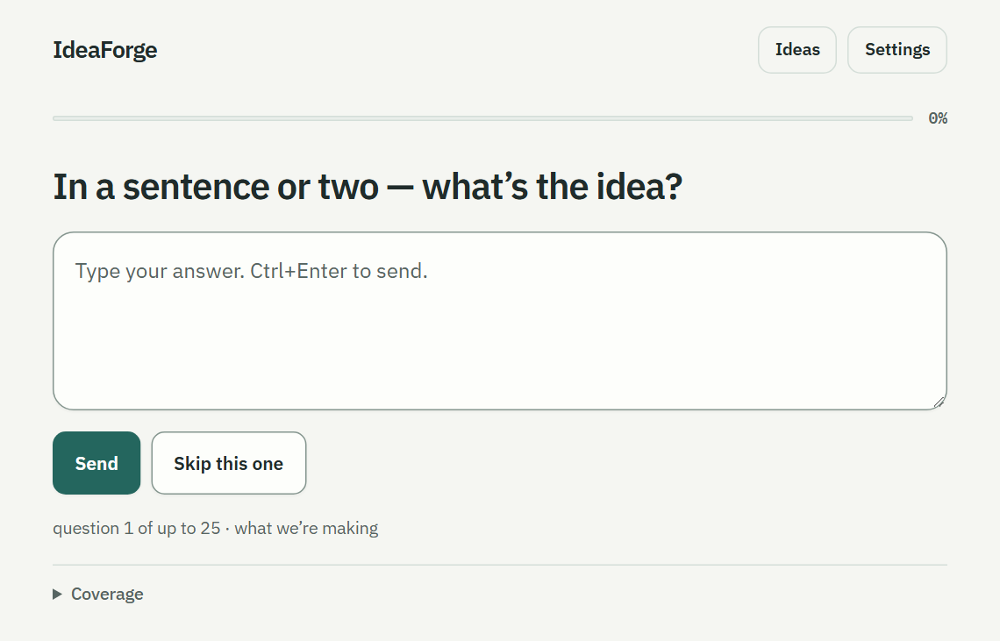
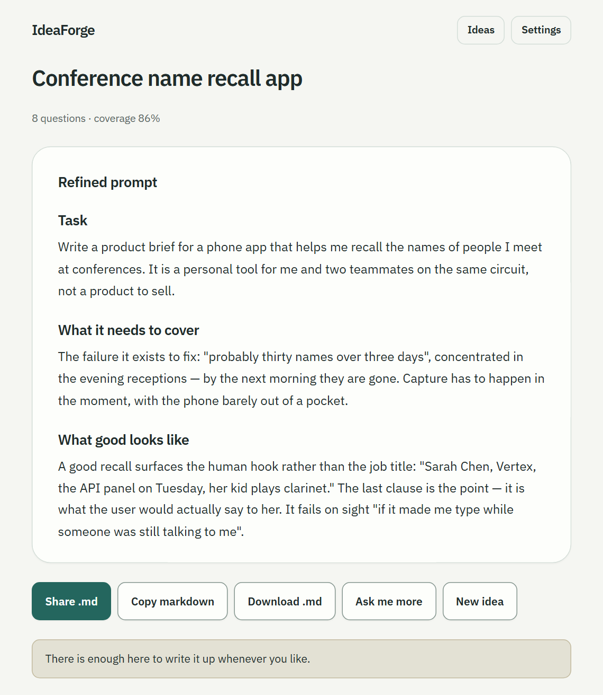
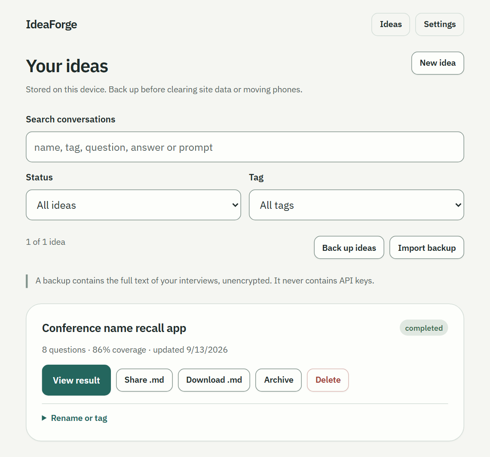
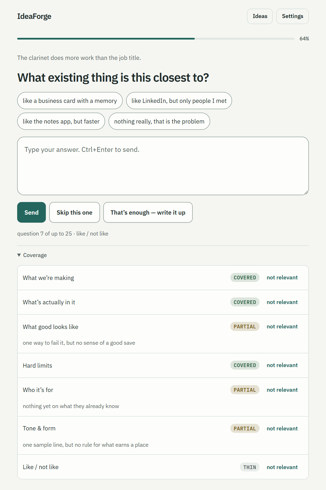
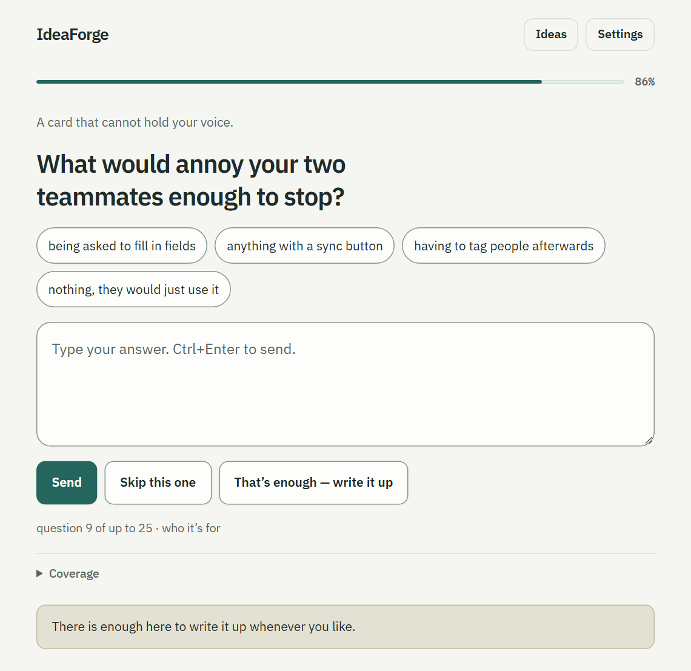
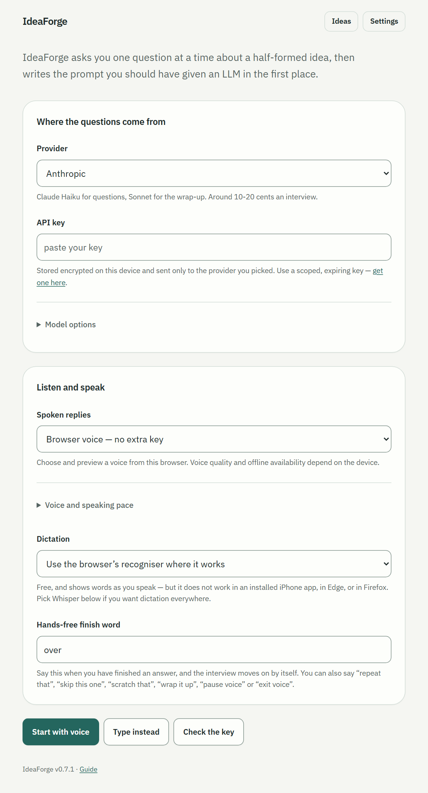

<p align="center">
  
</p>

# IdeaForge

[](https://github.com/jaypetez/ideaforge/actions/workflows/ci.yml)
[](LICENSE)
[](package.json)

An interviewer that forges a half-formed idea into a usable LLM prompt.

**→ [Try it](https://jaypetez.github.io/ideaforge/)** — it runs entirely in your browser
with your own API key. There is no IdeaForge account or application server. Model requests,
optional transcription and optional hosted speech go directly to their selected services;
browser recognition and network voices can also send content off the device.

**→ [Read the guide](https://jaypetez.github.io/ideaforge/guide/)** — installation,
interviews, mobile and voice, the Ideas library, providers, local models, privacy,
troubleshooting, development and delivery.

You have a vague idea. You know things about it you would never think to type — the real
numbers, the case you have in mind, the thing that would make you throw the output away.
IdeaForge asks you one question at a time until it has those, then writes the prompt you
should have given an LLM in the first place.

It stops on its own. Seven dimensions are tracked, and a dimension only counts as covered
when the model can quote you verbatim on it — so the interview ends when there is genuinely
enough to write from, not when the model feels finished.

## What it looks like

<p align="center">
  <picture>
    <source media="(prefers-color-scheme: dark)"
            srcset="docs/screenshots/08-voice-listening.dark.png">
    
  </picture>
</p>

Choose **Start with voice** and the question has the screen to itself. IdeaForge speaks,
then listens; the microphone display moves only with measured input, not an invented
waveform. If the browser cannot provide levels, it says so. **Pause** stops capture and
playback. **Exit** returns to the same interview in text.

Choose **Type instead** for the answer box, suggestion chips and coverage details:

<p align="center">
  <picture>
    <source media="(prefers-color-scheme: dark)"
            srcset="docs/screenshots/03-mid-interview.dark.png">
    
  </picture>
</p>

One question, a short bridge that proves it read your last answer, and three or four chips
you can tap if you would rather edit a sentence than write one. The line underneath tells you
which of the seven dimensions this question is serving, and the meter tells you how much is
left.

Every screenshot on this page, and the whole worked example below, is generated by
`npm run screenshots`. It drives the real app against a scripted model; the voice views use
scripted speech too. These are application captures, not mockups or evidence of a live
provider audition.

## From a half-formed idea to a forged prompt

Here is a complete interview. The idea it starts from is about as thin as they come.

<p align="center">
  <picture>
    <source media="(prefers-color-scheme: dark)"
            srcset="docs/screenshots/02-first-question.dark.png">
    
  </picture>
</p>

The first question is always the same one, and it never costs a model call. Everything after
it is built from what you just said:

```text
Q1  In a sentence or two — what’s the idea?
A1  An app that helps me remember the names of people I meet at conferences.

Q2  At the last conference, how many names did you actually lose?            concretize
A2  Probably thirty names over three days. The ones I lose are from the evening
    receptions, and by the next morning they are completely gone.

Q3  What would make you delete this in the first week?                       anti_goal
A3  I would delete it in the first week if it made me type while someone was
    still talking to me.

Q4  What are the hard limits on time and signal here?                        boundary
A4  Three seconds, one thumb, and it has to work with no signal. Those are hard
    limits — the conference wifi is gone by the afternoon.

…

Q6  Write the line you would want on screen when she walks up.               sample_output
A6  On screen I want one line: Sarah Chen, Vertex, the API panel on Tuesday, her
    kid plays clarinet. That last bit is what I would actually say to her.
```

Note what the questions are *not*. None of them asks about your target audience, your
go-to-market, or how you will measure success at scale — those are questions whose answers
the asker could have guessed, and the interviewer is forbidden from producing them. Each one
asks for an instance, a preference under pressure, or a boundary: the last conference, the
first week, the line on the screen.

Eight questions in, every dimension has your own specifics behind it and the interview offers
to stop. What it hands back:

```markdown
# Conference name recall app

_2026-09-13 · 8 questions · coverage 86% · synthesised by Claude_

## Refined prompt

## Task

Write a product brief for a phone app that helps me recall the names of people I meet
at conferences. It is a personal tool for me and two teammates on the same circuit, not
a product to sell.

## What good looks like

A good recall surfaces the human hook rather than the job title: "Sarah Chen, Vertex,
the API panel on Tuesday, her kid plays clarinet." The last clause is the point — it is
what the user would actually say to her. It fails on sight "if it made me type while
someone was still talking to me".

## Constraints

"Three seconds, one thumb, and it has to work with no signal." The conference wifi is
gone by the afternoon, so working offline is a requirement rather than a nice-to-have.
```

That is a prompt you could not have written in one sitting, because most of it is things you
knew but had no reason to type.
**[Read the whole exported file →](docs/examples/remember-names.md)** — it also carries the
assumptions the model had to make, the questions you did not answer, a coverage table, and
the full verbatim transcript.

<p align="center">
  <picture>
    <source media="(prefers-color-scheme: dark)"
            srcset="docs/screenshots/06-refined-prompt.dark.png">
    
  </picture>
</p>

## The conversations stay with the idea

Every interview is saved on the device as soon as a turn settles. The answer you are still
typing is saved after a short pause too, so closing the app halfway through a paragraph does
not throw it away.

<p align="center">
  <picture>
    <source media="(prefers-color-scheme: dark)"
            srcset="docs/screenshots/07-ideas-library.dark.png">
    
  </picture>
</p>

**Ideas** is the whole local library, not only a recent list. Search reaches names, tags,
questions, answers and the refined prompt. An idea can be renamed, tagged, archived,
restored or permanently deleted.

Nothing is synced to an IdeaForge account because there is no account or server. **Back up
ideas** downloads one JSON file containing every active and archived interview; **Import
backup** restores it on another device without silently overwriting a different local copy.
The backup never contains API keys, but its interview text is deliberately unencrypted, so
treat it like any other personal document.

On a finished idea, **Share .md** opens the phone's native share sheet with the complete
markdown file. If a browser cannot share files it shares the markdown as text; copy and
download remain available either way.

## Why it stops on its own

The interview is not counting turns. It is tracking seven dimensions, and each one is graded
against a writing test rather than a satisfaction test: *could I write this section right now,
from their own specifics, such that a stranger would make the same choices they would?*

<p align="center">
  <picture>
    <source media="(prefers-color-scheme: dark)"
            srcset="docs/screenshots/04-coverage.dark.png">
    
  </picture>
</p>

The model grades itself, and self-reported progress drifts optimistic, so the grades go
through a ratchet before they count. Coverage never falls. It rises at most one level per
dimension per turn, and at most two dimensions per turn. And `covered` is refused outright
unless the model can produce a **verbatim quote from you** to justify it — its own inference
is not evidence.

That last rule is the one doing the work. It is why the interview cannot congratulate itself
to a finish, and why a dimension you were vague about stays visibly open instead of being
written up from an invention.

When there is enough, it says so and leaves the decision to you:

<p align="center">
  <picture>
    <source media="(prefers-color-scheme: dark)"
            srcset="docs/screenshots/05-ready-to-wrap.dark.png">
    
  </picture>
</p>

Four other things can end it: you can wrap up whenever you like, you can mark a dimension
*not relevant* and it stops being asked about, a soft ceiling at 18 questions suggests
stopping, and a hard ceiling at 25 enforces it. There is also an exhaustion exit — if two
turns in a row produce no real gain *after* the ratchet has had its say, it offers to stop
rather than circling.

## Running it

No build step, no dependencies. Node 22 or newer, and any static server over a real origin:

```sh
npm run serve      # then open http://127.0.0.1:8765
```

`file://` will not work — ES modules, IndexedDB and the service worker all need an origin.
(`npm run serve` shells out to `python`; anything that serves a directory will do just as
well.)

Once the application shell has been cached, it can reopen offline and use the built-in
question bank until a model is reachable again. Installation does not make voice offline:
browser recognition and network voices may need a connection, as do hosted transcription
and hosted speech.

### Android

Open [the hosted app](https://jaypetez.github.io/ideaforge/) in Chrome. Use
**Install IdeaForge** when the app offers it; if Chrome does not show that button, open its
menu and choose **Install app** or **Add to Home screen**. Google's
[web-app instructions](https://support.google.com/chrome/answer/9658361?co=GENIE.Platform%3DAndroid&hl=en)
show the same browser flow.

The browser recogniser is the no-extra-key dictation path when its live probe succeeds.
IdeaForge handles recogniser restarts and Android-style growing final results, so repeated
guesses can be folded into one answer rather than counted as separate sentences. If the
level bars move but no words appear, this usually means the bars are keeping the
microphone from the recogniser. After a few seconds IdeaForge turns them off and
hands-free treats that capture as a miss
([recovery steps](https://jaypetez.github.io/ideaforge/guide/mobile-and-voice.html#recovery)),
so give the whole answer again. That logic has scripted coverage only; the redesign has not
been physically tested on an Android phone.

### iPhone

Open [the hosted app](https://jaypetez.github.io/ideaforge/) in Safari, tap **Share**, choose
**Add to Home Screen**, leave **Open as Web App** enabled if Safari shows it, then tap
**Add**. Apple's
[iPhone guide](https://support.apple.com/guide/iphone/open-as-web-app-iphea86e5236/ios)
shows the current controls.

For dictation in the installed app, configure Groq Whisper or OpenAI transcription. The
browser recogniser can exist in a home-screen app without ever producing an event;
IdeaForge tests it and reports when no usable input path exists. The redesign has not been
physically tested on an iPhone, in Safari or installed mode.

On either phone, use a hosted provider such as Groq, Anthropic, OpenAI or OpenRouter.
`localhost` and `127.0.0.1` mean the phone itself, not an Ollama or LM Studio server on your
computer, and IdeaForge deliberately refuses arbitrary LAN model endpoints rather than
weakening its key-exfiltration boundary.

## Run it with Docker

Published on every release as `ghcr.io/jaypetez/ideaforge`, for `linux/amd64` and
`linux/arm64`. It is nginx over the committed static site — no build step, nothing server-side,
and the container never talks to a model. Your browser does that directly, which is why your
API key never passes through anything of ours.

**A model and the app together, from one file.** Nothing to clone, nothing to build, and no
key anywhere. Needs an NVIDIA GPU — see the note in the file if you do not have one:

```sh
curl -fsSLO https://raw.githubusercontent.com/jaypetez/ideaforge/main/docker/compose.release.yml
docker compose -f compose.release.yml up -d
docker compose -f compose.release.yml exec ollama ollama pull qwen2.5:7b-instruct
# then open http://localhost:8765 and pick "Ollama (local)"
```

**Just the app**, pointed at an Ollama you already run. Works on any architecture, Apple
Silicon included:

```sh
docker run -d -p 127.0.0.1:8765:80 ghcr.io/jaypetez/ideaforge:latest
```

**From a clone**, building the image yourself rather than pulling it:

```sh
docker compose -f docker/compose.yml up -d
```

Both ends publish on `127.0.0.1` rather than `0.0.0.0`, and that is load-bearing: IdeaForge
refuses to talk to a model endpoint that is not loopback, because that restriction is what
stops an injected script posting a stored key somewhere else. Publishing on loopback keeps
the browser's view of both ends loopback, so the default path needs no configuration at all.

If you already run Ollama natively, port 11434 is taken and the container will not start.
`IDEAFORGE_OLLAMA_PORT=11435` moves this one, and you type that address into the app's
**Server address** field. Type `127.0.0.1`, not `localhost`: on a machine running more than
one Ollama those are not the same place — a native install binds `127.0.0.1` while a
Docker-published one binds `[::1]`, both report themselves as up, and which one you get
depends on whose resolver is asking.

## Bringing your own key

<p align="center">
  <picture>
    <source media="(prefers-color-scheme: dark)"
            srcset="docs/screenshots/01-setup.dark.png">
    
  </picture>
</p>

Pick a provider and paste a key. The options:

| Provider | Connection | Notes |
|---|---|---|
| **Groq** | hosted, your key | Can use the same key for Groq dictation. |
| **Anthropic** | hosted, your key | Haiku asks the questions, Sonnet writes the wrap-up by default. |
| **OpenAI** | hosted, your key | Separate question and wrap-up model choices. |
| **OpenRouter** | hosted, your key | Models served through its allowlisted API. |
| **Ollama / LM Studio** | local, no key in the UI | Pick an installed model — see below. |
| **Another local server** | local, no key in the UI | OpenAI-compatible and loopback only. |
| **Claude viewer** | no extra key | Only inside a viewer offering model sampling. |

Provider billing depends on the selected models and usage. Optional hosted transcription
and spoken replies are separate operations, not included by choosing an inference provider.

**Choosing the models.** Those defaults are only defaults. Every provider but the Claude
viewer offers two model boxes under **Model options**, because the calls are not alike:
a dozen questions, then one wrap-up that reads the whole transcript back. The section starts
collapsed for hosted providers and opens automatically for a local provider, which needs an
installed model name. Leave a hosted model box blank and the provider's own default runs;
the field shows which one.
Naming a cheap question model does not touch the wrap-up; you have to change that
separately, which is the point of there being two. Pressing **Check the key** fills the
suggestions from the provider's real catalogue wherever one is readable from a browser.

**About the key.** It is encrypted with a non-extractable `CryptoKey` and stored in
IndexedDB on your device, and it is sent to exactly one host — the provider you picked,
by that provider's adapter. The page's CSP allows the configured provider origins and
loopback, not arbitrary remote addresses. What encryption does *not* defend against is a
malicious script running on this origin, which could use the key exactly as the app does.
The mitigations are that this app has zero dependencies and no
third-party scripts, and that you should mint a **scoped, expiring** key rather than
handing it your main one.

Do not paste an API key into a **shared** Claude artifact — anyone the artifact is shared
with can read the page. Inside a Claude viewer, use the built-in `sample` provider.

**A local model is easiest from a local page.** `npm run serve`, pick Ollama, press
**Check the connection** and the model boxes fill with whatever you have actually pulled.
Ollama allows any localhost origin out of the box, so there is nothing to configure.

From the hosted site it takes two steps, and one of them is easy to miss. Ollama answers an
origin it does not recognise with no CORS headers at all, so it needs
`OLLAMA_ORIGINS=https://jaypetez.github.io` in its environment **and a restart** — it reads
that variable at startup, so exporting it in another shell changes nothing. LM Studio has
the same setting in its server panel. Chrome will also ask permission the first time a page
on the internet reaches your local network, which is a prompt to accept rather than
something to configure. Safari refuses an `http://` request from an `https://` page
outright and has no setting that changes it. So: if you want to run against a local model,
running the app locally too is still the path of least resistance.

## Talking instead of typing

**Start with voice** opens the focused voice view. The question or spoken caption, captured
words and status stay visible; the manual composer, coverage and navigation stay out of the
way. **Type instead** opens the ordinary interview, where **Answer out loud** still dictates
one answer for you to review before sending. Dictated answers are marked as such in the
export, and the interviewer is told to read them for intent.

### Taking turns

IdeaForge reads the question and then its suggestions before listening. There is no
always-listening interruption or voice barge-in: wait for **Listening to you**, or use the
buttons to stop playback. Say **“over”** at the end of an answer to send it; an ordinary pause
in speech is not the finish signal. The finish word is configurable in Settings.

Commands work only while listening, as whole utterances:

| Say | And it |
|---|---|
| “repeat that” | reads the question again |
| “skip this one” | moves on without answering |
| “scratch that” | discards the unfinished answer and listens again |
| “wrap it up” | requests the write-up once enough answers have been recorded |
| “pause voice” | stops voice until you tap Resume |
| “exit voice” | returns to the manual interview without wrapping it up |

When there is enough material the app asks whether to write it up, and you answer yes or
“keep going”. It reads the finished prompt aloud and leaves the Markdown available on screen.

<p align="center">
  <picture>
    <source media="(prefers-color-scheme: dark)"
            srcset="docs/screenshots/09-voice-paused.dark.png">
    
  </picture>
</p>

**Pause** releases the microphone, stops speech and keeps the captured draft. A recorded
segment may still need transcription, and a model request already submitted may finish for
that idea, but neither starts the next capture. **Resume** needs a deliberate tap; there is
no hidden listener waiting for a resume command. **Exit** keeps the interview and transcribed
words, or shows the export if the write-up is underway or complete. Untranscribed audio
cancelled on Exit is reported rather than passed off as saved text.

After Resume, saying just the finish word sends the retained draft. Repeated misses pause
rather than skip a question that already has draft words.

Empty captures without a draft follow a bounded retry, repeat and skip sequence. A blocked
microphone, failed playback or repeated input failure leaves an explicit recovery state, with
Resume and Exit available. Moving the app into the background pauses voice; installation
does not promise a lock-screen conversation.

### Choosing spoken replies

Browser speech is the default. Expand **Voice and speaking pace** in Settings to list the
voices this browser exposes, preview one and adjust its pace. The **on device** and
**network** labels describe the browser's report, not a quality ranking or an offline
guarantee.

Selecting OpenAI under **Spoken replies** opens **Voice and speaking pace** automatically.
Optional OpenAI speech uses a **separate speech key**: it never borrows the interview or
transcription key. You must accept that the voice is AI-generated, spoken text goes to
OpenAI and usage is metered, then complete **Check and preview OpenAI voice** successfully.
Until then, replies use the browser voice. A hosted failure visibly falls back to browser
speech; a failed check cannot pass by playing the fallback.

Switching back to browser speech or withdrawing consent disables hosted speech immediately
and saves that choice without requiring another interview. Enabling it again needs a new
successful check. A storage failure is reported rather than presented as a saved withdrawal.

No developer-authorised live speech key or spending cap was supplied for this redesign, so
live hosted CORS and voice quality remain unverified. An in-app preview checks that attempt
in that browser, not universal compatibility. Dictation is a separate input choice, and
neither browser recognition nor network speech is guaranteed offline. See
[Mobile and voice](https://jaypetez.github.io/ideaforge/guide/mobile-and-voice.html) for setup,
recovery and the untested physical-device limits.

## How it is built

```
src/core/       pure interview logic — no DOM, no network, no clock
src/runtime/    the turn loop; provider and clock injected, so it is testable offline
src/providers/  inference and hosted speech requests, shared HTTP policy
src/store/      IndexedDB sessions and the encrypted key
src/voice/      dictation, transcription requests, native speech and audio playback
src/ui/         the app shell
guide/          dependency-free public documentation published beside the app
```

`tools/lint-purity.mjs` fails the build if anything under `src/core/` or `src/runtime/` so
much as mentions `window`, `fetch` or `document`. That boundary is what keeps the interview
engine portable and the turn loop testable with no mocking framework and no network access.

```sh
npm test              # the purity lint, then the unit suite
npm run test:docs     # public guide/README facts, links and assistant wiring
npm run test:graph    # syntax-check the source and import every platform-free module
npm run test:browser:required  # real Chrome, with no missing-browser skip
npm run test:all      # all three gates above
npm run validate:local  # a whole interview against a real local model, no key, no human
npm run screenshots   # regenerate every image and the worked example above
```

The browser checks exist because IndexedDB, non-extractable WebCrypto keys, MediaRecorder,
the Web Speech API, service workers and the CSP have no Node equivalent, and code that
touches them can be perfectly green in `npm test` and broken in a browser. They assemble the
same publishable tree Pages receives before opening it, so a missing shipped file cannot hide
behind the fuller repository checkout.

The required browser run also includes separate real Web Audio and trusted-gesture policy
checks. The original media suite uses a synthetic microphone and bypasses autoplay; its
sequencing results do not prove real permission prompts, native recognition competing for a
microphone, or physical Android/iPhone behaviour. Neither suite is a live hosted-speech
compatibility or quality test.

## What it does when things break

An interview never dead-ends. If the model is unreachable, returns nonsense twice, or you
have no key at all, the next question comes from a built-in bank of 21 and the export says
so. The transcript and your open questions survive a failed wrap-up — only the refined
prompt is lost, and you can retry it.

## Contributing

[CONTRIBUTING.md](CONTRIBUTING.md) covers the setup, what a good change looks like, and
how to add a provider; [docs/ARCHITECTURE.md](docs/ARCHITECTURE.md) is the map — what owns
the session, what happens when a turn fails, and which costs this codebase has knowingly
taken on. [CLAUDE.md](CLAUDE.md) and [AGENTS.md](AGENTS.md) record the invariants that fail
silently when broken, which is most of them. Security policy and the honest threat model are in
[SECURITY.md](SECURITY.md).

Claude Code and GitHub Copilot CLI/VS Code share repository skills for provider, voice,
local-model, README, review, and explicit release work, plus client-specific read-only
review agents. [Coding assistant setup](CONTRIBUTING.md#coding-assistants) explains
discovery and use.

## Licence

MIT.
